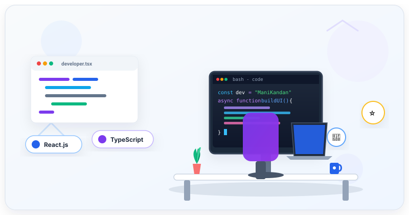

<!-- ============================================================== -->
<!--                  ManiKandan2403 GITHUB PROFILE                  -->
<!--            Theme: Modern Light • Blue & Purple Accents           -->
<!-- ============================================================== -->

<div align="center">

  <!-- Dynamic Waving Header Banner -->
  

  <!-- Animated Typing SVG -->
  <a href="https://github.com/ManiKandan2403">
    
  </a>

  <p align="center">
    <strong>Full Stack Developer</strong> specializing in clean architecture, interactive frontends, and responsive digital products.
  </p>

  <!-- Quick Action & Social Badges -->
  <p align="center">
    <a href="https://github.com/ManiKandan2403/Portfolio">
      
    </a>
    <a href="https://github.com/ManiKandan2403">
      
    </a>
    <a href="mailto:manikandanmagesh001@gmail.com">
      
    </a>
  </p>

  <!-- Developer Workstation Illustration -->
  <p align="center">
    
  </p>

</div>

---

<!-- ============================================================== -->
<!--                           ABOUT ME                             -->
<!-- ============================================================== -->

### 👨‍💻 About Me

<p align="left">
  Hello! I'm <strong>ManiKandan</strong>, a passionate <strong>Full Stack Developer</strong> focused on building elegant, responsive, and performant web applications. I love transforming challenging concepts into seamless digital products with clean code and modern design systems.
</p>

<p align="center">
  
  
  
  
</p>

```yaml
developer:
  name: ManiKandan
  title: Full Stack Developer
  github: "@ManiKandan2403"
  location: "India"
  status: "🟢 Open to Opportunities"
  expertise:
    - Frontend Architecture & Modern UI/UX
    - Full-Stack Web Development
    - RESTful API Integration & Backend Services
  current_focus:
    building: "Modern, responsive web applications utilizing component-based architectures."
    learning: "Modern full-stack ecosystems, TypeScript mastery, and cloud architecture."
    interests: "Modern JavaScript/TypeScript, UI/UX Design Systems, API Engineering."
  core_values:
    - "Clean, maintainable, and type-safe codebases"
    - "High aesthetic standards with accessible light themes"
    - "User-centered experiences that solve practical problems"
```

#### 📌 Snapshot & Highlights

| Area | Detail |
| :--- | :--- |
| 🔭 **What I Build** | Modern, responsive web applications utilizing component-based architectures. |
| 🌱 **Active Learning** | Modern full-stack ecosystems, TypeScript mastery, and cloud architecture. |
| 💬 **Ask Me About** | JavaScript, Frontend development, CSS/Tailwind, and web performance. |
| 🎯 **Career Goals** | Building high-impact web products that solve real-world problems. |
| ⚡ **Fun Fact** | When not coding, I enjoy discovering new developer tools and refining UI interactions. |

---

<!-- ============================================================== -->
<!--                          TECH STACK                            -->
<!-- ============================================================== -->

### 🛠️ Tech Stack & Skills

<div align="center">

  <!-- Overview Icon Ribbon -->
  <a href="#tech-stack--skills">
    
  </a>

</div>

<br />

#### 🌐 Languages & Core
| Technology | Category | Purpose |
| :--- | :--- | :--- |
|  **JavaScript (ES6+)** | Languages | Client-side dynamics & full-stack logic |
|  **TypeScript** | Languages | Scalable codebases & strong typing |
|  **HTML5** | Languages | Accessible, semantic document structures |
|  **CSS3** | Languages | Responsive layouts, animations & typography |

#### 💻 Frontend Development
| Technology | Category | Purpose |
| :--- | :--- | :--- |
|  **React.js** | Frontend | Component-driven, declarative user interfaces |
|  **Tailwind CSS** | Frontend | Utility-first, responsive, and maintainable CSS |

#### ⚙️ Backend & Systems
| Technology | Category | Purpose |
| :--- | :--- | :--- |
|  **Node.js** | Backend | High-performance asynchronous backend services |
|  **Express.js** | Backend | RESTful APIs and middleware routing |

#### 🗄️ Databases & Storage
| Technology | Category | Purpose |
| :--- | :--- | :--- |
|  **MongoDB** | Database | Flexible document data modeling |
|  **PostgreSQL** | Database | ACID-compliant relational data management |

#### 🧰 Tools & Platforms
| Technology | Category | Purpose |
| :--- | :--- | :--- |
|  **Git** | Tools | Distributed commit and branch management |
|  **GitHub** | Tools | Collaboration, issues & CI/CD workflows |
|  **VS Code** | Tools | Code editing, extensions & debugging |
|  **Postman** | Tools | API inspection, testing & documentation |

---

<!-- ============================================================== -->
<!--                        FEATURED PROJECTS                       -->
<!-- ============================================================== -->

### 🚀 Featured Projects

<table>
  <tr>
    <td width="50%" valign="top">
      <h3 align="left">🌐 Portfolio</h3>
      <p>Official personal portfolio website presenting projects, technology background, skills, and contact links in a clean modern interface.</p>
      <p>
        
        
        
      </p>
      <p>
        <a href="https://github.com/ManiKandan2403/Portfolio">
          
        </a>
        <a href="https://github.com/ManiKandan2403/Portfolio">
          
        </a>
      </p>
    </td>
    <td width="50%" valign="top">
      <h3 align="left">🌐 My-Portofolio</h3>
      <p>Interactive web portfolio showcase highlighting development work, responsive layouts, and structured project sections.</p>
      <p>
        
        
        
      </p>
      <p>
        <a href="https://github.com/ManiKandan2403/My-Portofolio">
          
        </a>
        <a href="https://github.com/ManiKandan2403/My-Portofolio">
          
        </a>
      </p>
    </td>
  </tr>
</table>

---

<!-- ============================================================== -->
<!--                        GITHUB STATISTICS                       -->
<!-- ============================================================== -->

### 📊 GitHub Analytics & Streak

<div align="center">

  <!-- GitHub Streak Stats (Light Blue & Purple Palette) -->
  <a href="https://github.com/ManiKandan2403">
    
  </a>

  <br /><br />

  <!-- GitHub Overall Stats & Most Used Languages -->
  <table border="0" cellpadding="0" cellspacing="0">
    <tr>
      <td valign="top" align="center">
        <a href="https://github.com/ManiKandan2403">
          
        </a>
      </td>
      <td valign="top" align="center">
        <a href="https://github.com/ManiKandan2403">
          
        </a>
      </td>
    </tr>
  </table>

</div>

---

<!-- ============================================================== -->
<!--                   CONTRIBUTION GRAPH ANIMATION                 -->
<!-- ============================================================== -->

### 🐍 Contribution Activity Graph

<div align="center">

  <!-- Snake Eating Contributions Animation -->
  

  <p align="center">
    <sub>⚡ <em>Updated automatically every 12 hours via GitHub Actions</em></sub>
  </p>

</div>

---

<!-- ============================================================== -->
<!--                      GITHUB TROPHIES                           -->
<!-- ============================================================== -->

### 🏆 GitHub Achievements

<div align="center">

  <a href="https://github.com/ManiKandan2403">
    
  </a>

</div>

---

<!-- ============================================================== -->
<!--                     CONNECT WITH ME                            -->
<!-- ============================================================== -->

### 📬 Connect With Me

<div align="center">

  <p>I'm always open to discussing new projects, creative ideas, or opportunities to be part of your vision.</p>

  <p align="center">
    <a href="mailto:manikandanmagesh001@gmail.com" target="_blank">
      
    </a>
    <a href="https://github.com/ManiKandan2403" target="_blank">
      
    </a>
    <a href="https://github.com/ManiKandan2403/Portfolio" target="_blank">
      
    </a>
  </p>

</div>

---

<!-- ============================================================== -->
<!--                         FOOTER                                 -->
<!-- ============================================================== -->

<div align="center">

  

  <p>
    <strong>Thanks for visiting my profile!</strong> ⭐<br />
    <em>Let's connect and build something impactful together.</em>
  </p>

  <p>
    <a href="#manikandan2403-github-profile">
      
    </a>
  </p>

</div>
